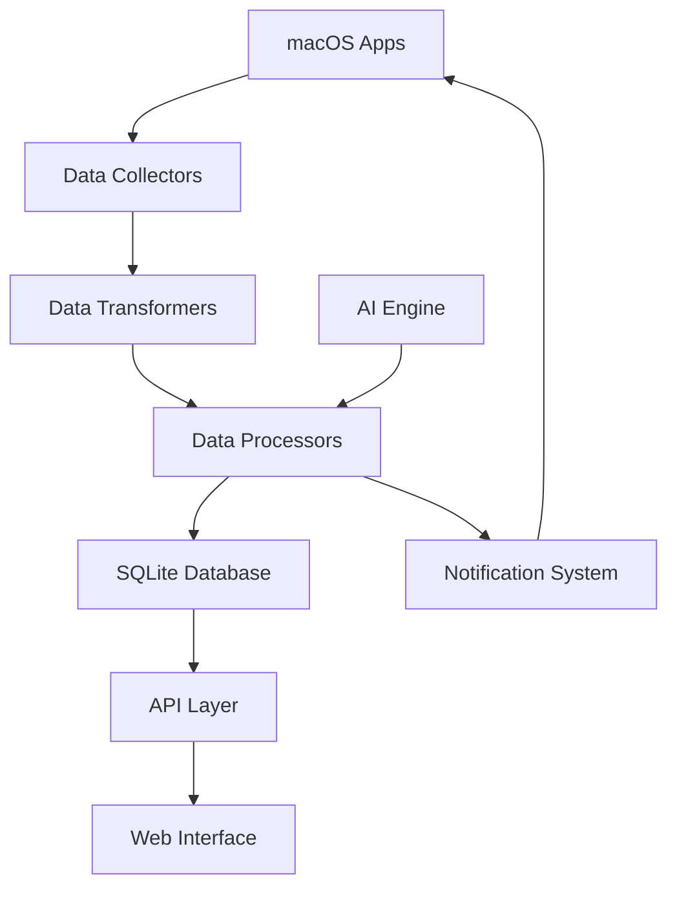

# macOS 生活管理系统

> 基于 Palantir 数据架构原理的现代生活管理平台

🚀 **部署状态**: Railway token已配置 - 启动完整后端部署...

[](https://python.org)
[](https://fastapi.tiangolo.com)
[](https://www.apple.com/macos/)
[](https://opensource.org/licenses/MIT)

## 🎯 项目愿景

将 Palantir 企业级数据架构的强大理念应用于个人生活管理，创建一个智能、高效、本地优先的生活管理系统。通过深度集成 macOS 生态系统，实现生活数据的自动收集、智能分析和优化建议。

## ✨ 核心特性

### 🏗️ Palantir 架构层次

- **本体层 (Ontology)**: 生活对象的结构化建模
  - 任务对象 (Tasks) - 优先级、时长、领域分类
  - 时间块对象 (Time Blocks) - 四域时间管理理论
  - 项目对象 (Projects) - 目标导向的任务组织
  - 人员对象 (Persons) - 关系网络管理

- **管道层 (Pipeline)**: 智能数据处理流水线
  - 自动数据收集 (macOS 日历、提醒事项)
  - 智能数据分类和标准化
  - 实时处理和状态更新
  - AI 驱动的洞察生成

- **平台层 (Foundry)**: 统一数据管理平台
  - 版本控制的数据存储
  - 工作流编排和自动化
  - 安全的数据访问控制
  - 历史数据分析和趋势识别

- **部署层 (Apollo)**: 配置和运维管理
  - 智能配置管理
  - 自动更新机制
  - 系统健康监控
  - 性能优化

### 🍎 macOS 深度集成

- **原生应用同步**: 无缝集成日历、提醒事项、通讯录
- **系统通知**: 智能提醒和进度通知
- **Shortcuts 支持**: 快速操作和自动化工作流
- **菜单栏集成**: 便捷的系统托盘访问
- **Apple Silicon 优化**: 针对 M1/M2 芯片优化

### 🤖 AI 智能功能

- **任务优先级算法**: 基于历史数据的智能排序
- **日程优化建议**: AI 驱动的时间安排优化
- **生产力模式识别**: 个人效率模式分析
- **智能分类**: 自动任务和时间块分类
- **预测性洞察**: 基于趋势的建议和提醒

### 📊 生活域管理

基于四域时间管理理论:

- **学术域 (Academic)**: 学习、研究、知识获取
- **收入域 (Income)**: 工作、项目、收入相关活动  
- **成长域 (Growth)**: 健康、技能提升、个人发展
- **生活域 (Life)**: 家庭、社交、日常维护

## 🚀 快速开始

### 系统要求

- macOS 11.0 (Big Sur) 或更高版本
- Python 3.9 或更高版本
- 4GB RAM (推荐 8GB)
- 2GB 可用存储空间

### 一键安装

```bash
# 下载并运行自动安装脚本
curl -fsSL https://raw.githubusercontent.com/life-management/macos-app/main/scripts/macos_setup.sh | bash
```

### 手动安装

```bash
# 1. 克隆项目
git clone https://github.com/life-management/macos-app.git
cd macos-app

# 2. 创建虚拟环境
python3 -m venv venv
source venv/bin/activate

# 3. 安装依赖
pip install -r requirements.txt

# 4. 初始化数据库
python -c "
from backend.database import engine
from backend.ontology.models import Base
Base.metadata.create_all(bind=engine)
"

# 5. 启动应用
python -m uvicorn backend.main:app --reload
```

### 启动系统

```bash
# 使用启动脚本
./start.sh

# 或直接运行
python -m uvicorn backend.main:app --host 127.0.0.1 --port 8000
```

访问 [http://127.0.0.1:8000](http://127.0.0.1:8000) 开始使用！

## 📱 界面预览

### 仪表板
- 四域统计概览
- 今日时间安排
- 紧急任务列表
- 最近活动动态

### 任务管理
- 智能任务分类
- AI 优先级排序
- 批量操作功能
- 进度跟踪视图

### 时间管理
- 可视化时间块
- 日程冲突检测
- 生产力评分
- 历史趋势分析

### 数据分析
- 生产力仪表板
- 域分布统计
- 效率趋势图表
- 个性化洞察

## 🛠️ 开发指南

### 项目结构

```
life_management/
├── backend/                 # Python 后端
│   ├── ontology/           # 数据模型层
│   ├── pipeline/           # 数据管道层
│   ├── foundry/            # 平台服务层
│   ├── apollo/             # 配置管理层
│   ├── api/                # API 路由
│   ├── ai/                 # AI 功能模块
│   └── integrations/       # macOS 集成
├── frontend/               # Web 前端
│   ├── static/             # 静态资源
│   └── templates/          # HTML 模板
├── data/                   # 数据存储
├── scripts/                # 工具脚本
└── docs/                   # 项目文档
```

### 开发环境设置

```bash
# 安装开发依赖
pip install -r requirements.txt
pip install -e .[dev]

# 设置 pre-commit 钩子
pre-commit install

# 运行测试
pytest

# 代码格式化
black backend/ frontend/
isort backend/ frontend/

# 类型检查
mypy backend/
```

### API 文档

启动应用后访问：
- **Swagger UI**: [http://127.0.0.1:8000/api/docs](http://127.0.0.1:8000/api/docs)
- **ReDoc**: [http://127.0.0.1:8000/api/redoc](http://127.0.0.1:8000/api/redoc)

## 🔧 配置说明

### 环境变量

复制 `.env.example` 到 `.env` 并根据需要修改配置：

```bash
cp .env.example .env
```

关键配置项：

```env
# 基础配置
DEBUG=true
DATABASE_URL=sqlite:///./data/database/life_management.db

# macOS 集成
MACOS_INTEGRATION_ENABLED=true
CALENDAR_SYNC_ENABLED=false
REMINDERS_SYNC_ENABLED=false

# AI 功能
AI_FEATURES_ENABLED=true
AI_PRIORITY_WEIGHT=0.7

# 时间管理
DEFAULT_TIME_BLOCK_DURATION=240
WORK_START_HOUR=9
WORK_END_HOUR=17
```

### 数据库配置

系统默认使用 SQLite，支持以下配置：

- **开发环境**: `sqlite:///./data/database/life_management.db`
- **生产环境**: 可配置为 PostgreSQL 或其他数据库
- **测试环境**: 内存数据库 `sqlite:///:memory:`

## 📊 架构详解

### 数据模型

```python
# 任务对象
class Task:
    title: str
    domain: TaskDomain  # academic, income, growth, life
    priority: TaskPriority  # 1-5 级别
    estimated_duration: int  # 预估时长(分钟)
    ai_priority_score: float  # AI 计算的优先级

# 时间块对象
class TimeBlock:
    start_time: datetime
    end_time: datetime
    domain: TaskDomain
    block_type: TimeBlockType  # focused, routine, buffer, break
    productivity_rating: int  # 生产力评分
```

### API 设计

RESTful API 设计，支持完整的 CRUD 操作：

```python
# 任务管理 API
GET    /api/v1/tasks              # 获取任务列表
POST   /api/v1/tasks              # 创建新任务
GET    /api/v1/tasks/{id}         # 获取任务详情
PUT    /api/v1/tasks/{id}         # 更新任务
DELETE /api/v1/tasks/{id}         # 删除任务
POST   /api/v1/tasks/{id}/complete # 完成任务

# 时间块管理 API
GET    /api/v1/timeblocks         # 获取时间块列表
POST   /api/v1/timeblocks         # 创建时间块
GET    /api/v1/timeblocks/optimize # 优化日程安排

# 分析 API
GET    /api/v1/analytics/summary  # 获取统计摘要
GET    /api/v1/analytics/productivity # 生产力分析
```

### 数据流架构



## 🤝 贡献指南

我们欢迎社区贡献！请查看 [CONTRIBUTING.md](CONTRIBUTING.md) 了解详细指南。

### 贡献类型

- 🐛 错误修复
- ✨ 新功能开发
- 📝 文档改进
- 🧪 测试用例
- 🎨 UI/UX 改进
- 🚀 性能优化

### 开发流程

1. Fork 项目并创建特性分支
2. 进行开发并添加测试
3. 确保代码通过所有检查
4. 提交 Pull Request

## 📈 路线图

### v1.0 (当前版本)
- [x] 基础架构搭建
- [x] macOS 日历/提醒集成
- [x] 四域时间管理
- [x] 基础 AI 功能
- [x] Web 界面

### v1.1 (计划中)
- [ ] 移动端 Companion App
- [ ] 高级 AI 洞察
- [ ] 团队协作功能
- [ ] 数据导出/导入
- [ ] 第三方应用集成

### v1.2 (未来版本)
- [ ] 语音控制集成
- [ ] Apple Watch 支持
- [ ] 云端同步选项
- [ ] 插件系统
- [ ] 多语言支持

## 📄 许可证

本项目采用 [MIT 许可证](LICENSE)。

## 🙏 致谢

- **Palantir Technologies** - 架构理念启发
- **Apple** - macOS 生态系统支持
- **FastAPI** - 现代 Web 框架
- **开源社区** - 优秀的工具和库

## 📞 联系我们

- **GitHub Issues**: [问题反馈](https://github.com/life-management/macos-app/issues)
- **讨论区**: [GitHub Discussions](https://github.com/life-management/macos-app/discussions)
- **邮箱**: team@lifemanagement.local
- **官网**: https://lifemanagement.local

---

**让数据驱动你的生活，让 AI 优化你的时间！**

*Built with ❤️ for macOS users who value efficiency and intelligence in life management.*